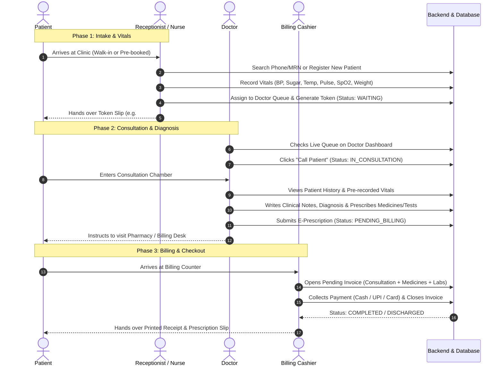
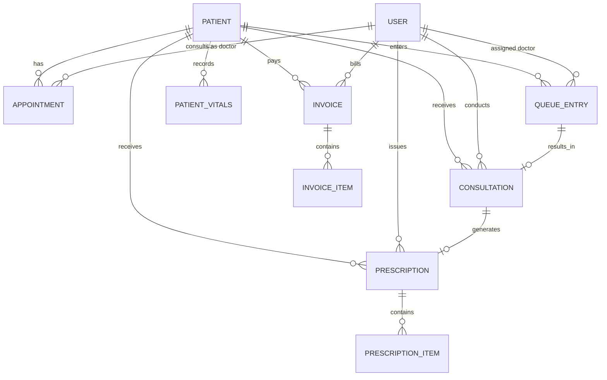

# Anwar Clinic — Clinical Management System & Admin Panel Architecture

**Document Version:** 1.0.0  
**Target Systems:** `admin-panel` (Next.js 16 / React 19 / Tailwind v4), `backend` (Node.js / Express / Sequelize / PostgreSQL)  
**Author:** Anwar Clinic Engineering & Product Architecture  
**Status:** Approved Specification & Implementation Blueprint  

---

## Table of Contents
1. [Executive Overview & Vision](#1-executive-overview--vision)
2. [Role Architecture & Access Control (RBAC)](#2-role-architecture--access-control-rbac)
3. [The Complete Patient Journey (End-to-End Walkthrough)](#3-the-complete-patient-journey-end-to-end-walkthrough)
4. [Queue & Patient Lifecycle State Machine](#4-queue--patient-lifecycle-state-machine)
5. [Detailed Module & Page Specifications](#5-detailed-module--page-specifications)
   - [5.1 Receptionist Desk & Queue Management](#51-receptionist-desk--queue-management)
   - [5.2 Vitals & Triage Capture Interface](#52-vitals--triage-capture-interface)
   - [5.3 Doctor Dashboard & Consultation Room (E-Prescription)](#53-doctor-dashboard--consultation-room-e-prescription)
   - [5.4 Appointments Scheduling Module](#54-appointments-scheduling-module)
   - [5.5 Patients Directory & Electronic Health Records (EHR)](#55-patients-directory--electronic-health-records-ehr)
   - [5.6 Prescriptions Hub & History](#56-prescriptions-hub--history)
   - [5.7 Billing, Invoicing & Cashier POS](#57-billing-invoicing--cashier-pos)
   - [5.8 Clinical & Operational Reports](#58-clinical--operational-reports)
   - [5.9 Role-Specific Dynamic Dashboards](#59-role-specific-dynamic-dashboards)
6. [Database Schema & Entity Relationship Model](#6-database-schema--entity-relationship-model)
7. [REST API Architecture & Endpoints Matrix](#7-rest-api-architecture--endpoints-matrix)
8. [Implementation Roadmap & Milestones](#8-implementation-roadmap--milestones)

---

## 1. Executive Overview & Vision

Anwar Clinic operates both aesthetic outpatient procedures (hair transplant, dermatology, PRP) and general clinical consultations. Currently, the admin panel possesses robust foundations for content (Blogs, Offers, Services, Jobs, Media, Leads) and dynamic RBAC. However, the core **Hospital / Clinic Information System (HIS / CIS)** modules remain placeholders:

- **Dashboard:** General summary and role-customized control centers.
- **Appointments:** Booking, scheduling, and calendar management.
- **Patients:** Patient registration, search, medical history, and EHR.
- **Prescriptions:** Digital Rx authoring, drug dosage, and print layouts.
- **Billing:** Invoicing, POS checkout, payment collection, and receipts.
- **Reports:** Operational, revenue, doctor productivity, and patient metrics.
- **Receptionist & Triage Desk:** Patient intake, vitals recording, and live queue assignment.

This document serves as the master technical blueprint for engineering these clinical modules into a frictionless, end-to-end workflow connecting the **Receptionist**, **Doctor**, **Billing Cashier**, and **Clinic Administrator**.

---

## 2. Role Architecture & Access Control (RBAC)

The system relies on granular permissions stored in PostgreSQL and resolved dynamically through the Next.js `PermissionsContext`. Each staff member logs into `/[role]/dashboard` where their permissions govern their reachable navigation items and actionable UI elements.

### Clinical Roles & Permission Mapping

| Module / Permission | `admin` | `doctor` | `receptionist` | `cashier` | `nurse` |
|---|:---:|:---:|:---:|:---:|:---:|
| `dashboard:read` | ✅ | ✅ | ✅ | ✅ | ✅ |
| `appointments:read` | ✅ | ✅ | ✅ | ✅ | ✅ |
| `appointments:write` | ✅ | ❌ (View only) | ✅ | ❌ | ❌ |
| `patients:read` | ✅ | ✅ | ✅ | ✅ | ✅ |
| `patients:write` | ✅ | ✅ | ✅ | ❌ | ✅ |
| `vitals:read` | ✅ | ✅ | ✅ | ❌ | ✅ |
| `vitals:write` | ✅ | ✅ | ✅ | ❌ | ✅ |
| `queue:read` | ✅ | ✅ (Own queue) | ✅ (All doctors) | ✅ (Status only) | ✅ |
| `queue:write` | ✅ | ✅ (Call/Complete) | ✅ (Token/Assign) | ❌ | ✅ |
| `consultation:write` | ✅ | ✅ | ❌ | ❌ | ❌ |
| `prescriptions:read` | ✅ | ✅ | ✅ | ✅ | ✅ |
| `prescriptions:write` | ✅ | ✅ | ❌ | ❌ | ❌ |
| `billing:read` | ✅ | ❌ | ✅ | ✅ | ❌ |
| `billing:write` | ✅ | ❌ | ✅ | ✅ | ❌ |
| `reports:read` | ✅ | ✅ (Own metrics) | ❌ | ✅ (Shift cashier) | ❌ |

---

## 3. The Complete Patient Journey (End-to-End Walkthrough)

The clinical encounter follows a deterministic 7-phase sequence where every step transitions the patient's state, updating the live queue across receptionist and doctor screens without page reloads.



### Phase-by-Phase Walkthrough

1. **Intake & Identity Verification:**
   - Patient arrives at reception.
   - Receptionist searches patient by phone number or Medical Record Number (MRN).
   - If new, receptionist creates record (Full Name, Phone, Age/DOB, Gender, Emergency Contact, Medical Alerts/Allergies).
   - If appointment was pre-booked online, receptionist clicks **"Check-In"**.

2. **Triage & Vitals Acquisition:**
   - Receptionist or OPD nurse records vital stats: Blood Pressure (`Systolic / Diastolic`), Pulse (`BPM`), Body Temperature (`°F`), Oxygen Saturation (`SpO2 %`), Random Blood Sugar (`mg/dL`), Body Weight (`kg`), and Height (`cm`).
   - The system automatically calculates **BMI** (`kg/m²`) with color-coded risk flags (Underweight, Normal, Overweight, Obese).
   - Receptionist logs the primary **Chief Complaint** (e.g., "Severe hair thinning at crown for 6 months").

3. **Queue Assignment & Token Generation:**
   - Receptionist selects the target Doctor (or system auto-selects if pre-booked).
   - Priority flag can be assigned: `Normal`, `Follow-up`, `Emergency`, or `Senior/VIP`.
   - A Token Number is generated (e.g., `TK-014`).
   - Patient record enters state: `WAITING_FOR_DOCTOR`.
   - Waiting room TV / queue monitor updates in real-time.

4. **Doctor Chamber & Clinical Encounter:**
   - Doctor dashboard displays:
     - Currently consulting patient.
     - Up next in queue (with tokens, waiting times, and reason for visit).
   - Doctor clicks **"Call Next Patient"**:
     - System updates status to `IN_CONSULTATION`.
     - Waiting room monitor rings chime and displays "Token TK-014 -> Chamber 2".
   - Doctor reviews pre-recorded vitals (abnormal vitals highlighted in amber/red alert banners).
   - Doctor conducts examination and inputs:
     - **Subjective:** Symptoms, duration, history of presenting illness.
     - **Objective:** Clinical findings, trichoscopy / scalp analysis / skin notes.
     - **Assessment:** Clinical Diagnosis (e.g., *Androgenetic Alopecia Grade IV* or *Seborrheic Dermatitis*).
     - **Plan (Prescription):** Medicine selector with auto-complete from inventory, dosage frequency (`1-0-1`), duration (`30 days`), instruction (`After food`).
     - **Lab Orders / Diagnostic Procedures:** e.g., CBC, Serum Ferritin, Thyroid panel.
     - **Follow-up Date:** e.g., "Review in 4 weeks".

5. **Consultation Sign-off:**
   - Doctor clicks **"Sign & Finalize Prescription"**.
   - System locks clinical notes, creates a digitally signed Prescription record, and triggers status update to `PENDING_BILLING`.
   - Doctor's queue immediately advances, presenting the next patient.

6. **Billing, Invoicing & Pharmacy Dispensing:**
   - Patient reaches the Cashier/Billing counter.
   - Cashier's screen automatically lists patients in `PENDING_BILLING`.
   - Cashier clicks the patient:
     - An itemized invoice is pre-generated consisting of:
       - Doctor Consultation Fee (auto-filled according to doctor fee tier).
       - Prescribed Medicines from Clinic Pharmacy (auto-filled with inventory prices).
       - In-clinic procedures/tests (e.g., PRP session, Dermaroller).
     - Cashier applies valid discounts, promo offers, or tax exemptions.
     - Records payment method (Cash, UPI / QR, Credit Card, Bank Transfer).
   - Cashier clicks **"Print Invoice & Discharge"**:
     - Status updates to `COMPLETED` / `DISCHARGED`.
     - High-speed thermal or A4 invoice prints out with clinic header and prescription attached.

7. **Patient Follow-Up & Analytics:**
   - System schedules an automated WhatsApp / SMS reminder 2 days before the scheduled follow-up date.
   - All metrics (revenue, patient count, average wait time, doctor consultation time) feed into the administrative reports engine.

---

## 4. Queue & Patient Lifecycle State Machine

The clinic encounter is governed by a strict state machine to prevent race conditions and maintain full audit accountability:

```
[SCHEDULED] (Online / Phone)
     │
     ▼ (Patient arrives at front desk)
[CHECKED_IN]
     │
     ▼ (Vitals & Chief complaint saved)
[WAITING] (In queue for assigned Doctor)
     │
     ▼ (Doctor clicks "Call Patient")
[IN_CONSULTATION] ───(Sent for immediate Lab/Procedure)───► [IN_PROCEDURE]
     │                                                               │
     │◄──────────────────(Returns from procedure)────────────────────┘
     ▼ (Doctor signs prescription)
[PENDING_BILLING]
     │
     ▼ (Invoice settled at Cashier)
[COMPLETED] (Discharged)

* Alternative exit states:
  - [CANCELLED]: Before check-in
  - [NO_SHOW]: Patient did not arrive
  - [LEFT_WITHOUT_BEING_SEEN]: Left queue prematurely
```

### State Definitions & Trigger Matrix

| State Name | Allowed Prior States | Trigger Event | Actor | Next Allowed States |
|---|---|---|---|---|
| `SCHEDULED` | *None (Initial)* | Pre-booking via website or call | Receptionist / Patient | `CHECKED_IN`, `CANCELLED`, `NO_SHOW` |
| `CHECKED_IN` | `SCHEDULED`, *Walk-in* | Patient physically reports to front desk | Receptionist | `WAITING` |
| `WAITING` | `CHECKED_IN` | Vitals captured & token generated | Receptionist / Nurse | `IN_CONSULTATION`, `CANCELLED` |
| `IN_CONSULTATION` | `WAITING` | Doctor clicks "Call Next" in panel | Doctor | `IN_PROCEDURE`, `PENDING_BILLING` |
| `IN_PROCEDURE` | `IN_CONSULTATION` | Sent for minor scalp treatment / lab sample | Doctor | `IN_CONSULTATION`, `PENDING_BILLING` |
| `PENDING_BILLING` | `IN_CONSULTATION`, `IN_PROCEDURE` | Doctor clicks "Finalize Prescription" | Doctor | `COMPLETED` |
| `COMPLETED` | `PENDING_BILLING` | Invoice marked as PAID / Settled | Cashier / Receptionist | *Terminal State* |
| `CANCELLED` | `SCHEDULED`, `WAITING` | Patient cancels or leaves | Receptionist / Admin | *Terminal State* |
| `NO_SHOW` | `SCHEDULED` | End-of-day auto-expiry of unvisited slots | System Scheduler | *Terminal State* |

---

## 5. Detailed Module & Page Specifications

### 5.1 Receptionist Desk & Queue Management
**Route:** `/[role]/reception` or embedded into `/[role]/patients` & `/[role]/appointments`  
**Required Permissions:** `patients:write`, `appointments:write`, `queue:write`

#### UI Components & Functional Layout
1. **Top Bar — Quick Patient Search & Register:**
   - Instant Search Input (searches simultaneously by Mobile Number, MRN, First Name, Last Name).
   - "New Walk-In Patient" primary button (opens fast registration slide-over modal).
2. **Doctor Queue Board (Multi-Column Kanban or Filterable Table):**
   - Doctor selector tabs (e.g., "Dr. Anwar", "Dr. Sarah", "All Chambers").
   - Shows active tokens: Token #, Patient Name, Wait Time (with badge turning yellow after 20 mins, red after 40 mins), Priority Tag.
   - Action dropdown per row: *Reassign Doctor*, *Bump Priority (Emergency)*, *Cancel Token*, *Print Token Slip*.
3. **Queue Summary Metric Badges:**
   - `Waiting in Clinic`: Count of active tokens with `WAITING` status.
   - `In Doctor Chambers`: Count of active consultations.
   - `Pending Payment`: Count of patients waiting at cashier.
   - `Average Wait Time`: Live computed metric for today.

---

### 5.2 Vitals & Triage Capture Interface
**Modal / Dedicated Step during Patient Check-in**  
**Required Permissions:** `vitals:write`

#### Form Fields & Normal Ranges Validation

```
+--------------------------------------------------------------------------+
| RECORD PATIENT VITALS & TRIAGE                       Patient: John Doe   |
+--------------------------------------------------------------------------+
| 1. Blood Pressure:  [ 120 ] / [ 80 ] mmHg        (Normal: 90/60 - 120/80)|
| 2. Pulse Rate:      [ 74  ] bpm                  (Normal: 60 - 100 bpm)  |
| 3. Temperature:     [ 98.4] °F                   (Fever alert: > 99.5°F) |
| 4. SpO2 Level:      [ 99  ] %                    (Hypoxia alert: < 95%)  |
| 5. Blood Sugar:     [ 110 ] mg/dL  [Random  v]   (Fasting/Random/PP)     |
| 6. Weight:          [ 72.5] kg                   7. Height: [ 175 ] cm   |
|                                                                          |
| Computed BMI: 23.7 kg/m²  [ NORMAL WEIGHT (Green Badge) ]                |
|                                                                          |
| Chief Complaint / Reason for Consultation:                               |
| [ Sudden patchy hair loss on beard and scalp for past 3 weeks...       ] |
|                                                                          |
| Medical Alerts / Allergies:                                              |
| [!] Allergic to Penicillin / Sulfa drugs                                 |
+--------------------------------------------------------------------------+
| [Cancel]                                 [Save Vitals & Send to Doctor]  |
+--------------------------------------------------------------------------+
```

- **Visual Alert System:** If any vital exceeds clinically safe thresholds (e.g., BP Systolic > 140 or < 90; Temp > 100°F; SpO2 < 94%), the input borders switch to bold crimson with a warning badge visible to both receptionist and doctor.

---

### 5.3 Doctor Dashboard & Consultation Room (E-Prescription)
**Route:** `/[role]/consultation/[queueId]` or `/[role]/dashboard` (when logged in as Doctor)  
**Required Permissions:** `consultation:write`, `prescriptions:write`

The Doctor's screen is designed for high-density, ergonomic medical workflows with zero unnecessary clicks.

#### Layout Architecture
- **Left Panel (35% width) — Patient Medical Chart & Context:**
  - Patient header: Photo/Avatar, Name, Age, Gender, Blood Group, MRN.
  - **Allergies & High-Risk Alert Banner:** Highlighted in red (e.g., "ALLERGY: Penicillin", "Hypertensive").
  - **Today's Vitals Card:** Captured 10 minutes ago by Reception, with color indicators.
  - **Visit History Accordion:** Past visits, past prescriptions, before/after hair transplant graft photos.
- **Right Panel (65% width) — Active Clinical Workspace:**
  1. **Clinical Assessment:**
     - Chief Complaint (prefilled from triage, doctor can edit).
     - Clinical Examination & Diagnosis (Autocomplete with common diagnoses, e.g., Male Pattern Baldness Norwood 3V, Alopecia Areata, Telogen Effluvium).
     - Clinical Notes / Trichoscopy findings.
  2. **Prescription Drug Builder:**
     - Medicine Search Bar (Queries inventory/master formulary: Brand name + Generic formulation).
     - Form: Tablet / Syrup / Lotion / Shampoo / Topical Foam / Serum.
     - Strength (e.g., `Finasteride 1mg`, `Minoxidil 5% Topical`, `Biotin 10mg`).
     - Dosage & Schedule: Easy toggle buttons: `1-0-0`, `1-0-1`, `0-0-1`, `1-1-1`, `Once Weekly`.
     - Food timing: `Before Food`, `After Food`, `At Bedtime`, `Apply to dry scalp`.
     - Duration: `15 Days`, `30 Days`, `60 Days`, `90 Days`.
     - Quantity: Auto-calculated based on frequency * duration.
  3. **Diagnostic Investigations & Procedures:**
     - Recommended Lab tests (e.g., Scalp Biopsy, Serum Iron/Ferritin, Vitamin D3).
     - In-clinic aesthetic procedures (e.g., PRP Hair Treatment Session 1 of 4).
  4. **Advice & Follow-Up:**
     - General dietary and lifestyle advice.
     - Follow-up date selector (e.g., "After 30 days" with one-click presets: `1 week`, `2 weeks`, `1 month`, `3 months`).
  5. **Action Footer:**
     - `Save as Draft`
     - `Sign & Finalize Prescription` (Generates verified digital prescription with clinic seal, locks the encounter, and dispatches the patient to Billing).

---

### 5.4 Appointments Scheduling Module
**Route:** `/[role]/appointments`  
**Required Permissions:** `appointments:read`, `appointments:write`

#### Features & Views
1. **Interactive Calendar / Timeline View:**
   - Day / Week / Month toggles.
   - Doctor filter dropdown (view schedule for all doctors side-by-side).
   - Time slots grouped in 15/30-minute intervals from 09:00 AM to 08:00 PM.
   - Visual slot status: Available (light green), Booked (blue), Checked-in (purple), Blocked/Leave (gray).
2. **Appointment Creation Modal:**
   - Existing patient search or new patient quick-entry.
   - Select Doctor, Specialty, Appointment Type (New Consultation, Follow-up, Procedure / Surgery, Post-op Review).
   - Date & available time slot selector (prevents double-booking).
   - Channel tag: `Website`, `Phone Call`, `Walk-in`, `WhatsApp`.
3. **Appointment Actions & Status Controls:**
   - One-click "Check-in Patient" (immediately moves appointment into the live OPD queue).
   - "Reschedule" with slot availability checker.
   - "Cancel" with mandatory reason dropdown.

---

### 5.5 Patients Directory & Electronic Health Records (EHR)
**Route:** `/[role]/patients`  
**Required Permissions:** `patients:read`, `patients:write`

#### Components
1. **Data Table & Advanced Filtering:**
   - Columns: MRN, Patient Name, Phone, Age/Gender, Last Visit Date, Total Visits, Primary Doctor, Status.
   - Search bar: Full-text search with debounced typing.
   - Filter by: Doctor, Gender, Date Range, Registration source.
2. **Comprehensive Patient 360° Profile (`/[role]/patients/[id]`):**
   - **Tab 1: Overview:** Demographics, Emergency Contacts, Permanent Address, Blood Group, Medical History.
   - **Tab 2: Vitals History:** Graph over time (BP trends, Weight changes, Blood Sugar history).
   - **Tab 3: Consultations & Prescriptions:** Chronological feed of every past visit with full doctor notes and PDF prescription downloads.
   - **Tab 4: Invoices & Payments:** Billing history, payment receipts, outstanding balances.
   - **Tab 5: Clinical Media & Documents:** Uploaded lab reports, scalp trichoscopy scans, pre-op/post-op clinical photography.

---

### 5.6 Prescriptions Hub & History
**Route:** `/[role]/prescriptions`  
**Required Permissions:** `prescriptions:read`, `prescriptions:write`

#### Components
1. **Central Prescription Index:**
   - Table of all issued prescriptions with Rx ID (e.g., `RX-2026-0089`), Date, Patient Name, Prescribing Doctor, Diagnosis, and Dispensing Status (`Pending`, `Dispensed`, `Partially Dispensed`).
2. **Prescription Print & Share Engine:**
   - **Print Preview Modal:** Clean, formatted medical layout designed for A4 and A5 paper:
     - Header: Anwar Clinic logo, address, contact numbers, Doctor name, qualifications & registration number.
     - Patient Info: Name, Age, Gender, Date, MRN, Vitals summary (BP, Pulse, Weight).
     - Rx Symbol with table of prescribed medicines, dosage, and duration.
     - Clinical diagnosis, tests advised, doctor advice.
     - Footer: Doctor digital signature, clinic registration number, and disclaimer.
   - **Direct Actions:**
     - `Print PDF`
     - `Send to WhatsApp` (triggers automated message to patient's mobile with secured PDF link)
     - `Send to Email`

---

### 5.7 Billing, Invoicing & Cashier POS
**Route:** `/[role]/billing`  
**Required Permissions:** `billing:read`, `billing:write`

#### Components
1. **Unbilled Queue (Pending Invoices):**
   - Automatically populates when doctors finalize consultations or when reception books paid procedures.
   - Shows: Patient Name, Doctor, Consultation Date, Pending Items (Doctor fee + Prescriptions + Labs).
2. **Interactive Invoice Generator Modal / Screen:**
   - Line Items Table with editable quantity, unit price, and discount:
     - Item 1: `Consultation Fee (Dr. Anwar)` — ₹1,000.
     - Item 2: `Minoxidil 5% Topical Solution (60ml)` — ₹650.
     - Item 3: `PRP Therapy (Single Session)` — ₹3,500.
   - Subtotal, Tax / GST calculation (configurable 0%, 5%, 12%, 18%), and Discount code / Manual discount input.
   - Total Net Payable.
3. **Payment Collection Controls:**
   - Payment Methods: `Cash`, `UPI / QR Code`, `Credit/Debit Card`, `Net Banking`, `Split Payment`.
   - Cash tender calculator (Amount Received vs Change to Return).
   - Split payment support (e.g., ₹2,000 UPI + ₹3,150 Cash).
4. **Thermal / A4 Tax Invoice Printing:**
   - Instant print trigger with standard GST compliant invoice format.

---

### 5.8 Clinical & Operational Reports
**Route:** `/[role]/reports`  
**Required Permissions:** `reports:read`

#### Standard Reports Suite
1. **Daily Cashier & Collection Summary:**
   - Breakdown of cash collected, card swipes, and UPI payments for the shift/day.
   - Discrepancy reconciliation report.
2. **Doctor Revenue & Productivity Report:**
   - Patients seen per doctor (New vs Follow-up).
   - Average consultation duration.
   - Total revenue generated (Consultations + Procedures referred).
3. **OPD Footfall & Queue Bottleneck Analytics:**
   - Peak check-in hours of the day.
   - Average patient waiting time from check-in to consultation.
4. **Inventory & Pharmacy Consumption Report:**
   - Top prescribed medications.
   - Fast-depleting items and reorder alerts.
5. **Exporting Capabilities:**
   - Export any report to `.xlsx` (Excel) or `.pdf`.

---

### 5.9 Role-Specific Dynamic Dashboards
**Route:** `/[role]/dashboard`  
**Required Permissions:** `dashboard:read`

The dashboard automatically renders the role-relevant widgets based on the logged-in user:

#### 1. Doctor Dashboard View
- **Current Patient in Chamber:** Large card displaying patient photo, name, age, today's vitals, and "Open Consultation" button.
- **Upcoming Patient Queue (Live):** List of next 5 waiting patients with token numbers and wait timers.
- **Quick Statistics:**
  - Patients Consulted Today (`14 / 22`)
  - Average Consult Time (`11 mins`)
  - Follow-ups Scheduled This Week (`38`)
- **Quick Action:** "Call Next Patient" button (advances queue).

#### 2. Receptionist / Front-Desk Dashboard View
- **Live Clinic Traffic Counters:**
  - Total Registered Today
  - Patients Currently in Waiting Lobby
  - Patients Currently with Doctors
  - Pending Bills at Cashier
- **Action Central:**
  - Button: `+ Register Walk-In Patient`
  - Button: `Record Vitals & Issue Token`
  - Button: `Book Appointment`
- **Chamber Status Grid:** Quick visual card for each doctor (e.g., "Dr. Anwar: In Consultation with TK-014", "Dr. Sarah: Available").

#### 3. Admin / Clinic Director Dashboard View
- **Executive KPIs:**
  - Total Revenue Today & This Month (with % comparison to last month).
  - Total Patient Footfall (New vs Returning).
  - Bed / Procedure Room Occupancy Rate (Hair Transplant OTs).
  - Leads Conversion Rate (from website landing page into paid appointments).
- **Recent Activity Feed:** Real-time log of check-ins, prescriptions issued, and payments received.

---

## 6. Database Schema & Entity Relationship Model

The clinical architecture integrates directly into the existing PostgreSQL database via Sequelize ORM.



### Table Definitions & Attributes

#### 1. `patients` (Master Patient Registry)
```typescript
interface PatientAttributes {
  id: string; // UUID primary key
  mrn: string; // Unique Medical Record Number, e.g. "ANW-26-00421"
  firstName: string;
  lastName: string;
  phone: string; // Indexed for rapid lookup
  email?: string;
  gender: "male" | "female" | "other";
  dob?: Date;
  age?: number;
  bloodGroup?: "A+" | "A-" | "B+" | "B-" | "AB+" | "AB-" | "O+" | "O-";
  allergies?: string[]; // e.g. ["Penicillin", "NSAIDs"]
  chronicConditions?: string[]; // e.g. ["Hypertension", "Diabetes"]
  emergencyContactName?: string;
  emergencyContactPhone?: string;
  address?: string;
  city?: string;
  createdById?: string; // Foreign key -> User (Receptionist)
  createdAt: Date;
  updatedAt: Date;
}
```

#### 2. `appointments` (Scheduled Encounters)
```typescript
interface AppointmentAttributes {
  id: string; // UUID
  appointmentNumber: string; // e.g. "APT-2609-0012"
  patientId: string; // Foreign key -> Patient
  doctorId: string; // Foreign key -> User (Doctor)
  appointmentDate: Date; // "2026-10-01"
  timeSlot: string; // "10:30-11:00"
  type: "new_consultation" | "follow_up" | "procedure" | "review";
  channel: "website" | "walk_in" | "phone" | "whatsapp";
  status: "scheduled" | "checked_in" | "cancelled" | "completed" | "no_show";
  notes?: string;
  createdById?: string;
}
```

#### 3. `queue_entries` (Live Daily Waiting Queue)
```typescript
interface QueueEntryAttributes {
  id: string; // UUID
  tokenNumber: string; // e.g. "TK-024" or "A-12"
  queueDate: string; // "YYYY-MM-DD"
  patientId: string; // Foreign key -> Patient
  doctorId: string; // Foreign key -> User (Doctor)
  appointmentId?: string; // Foreign key -> Appointment (null if walk-in)
  priority: "normal" | "follow_up" | "emergency" | "vip";
  status: "waiting" | "in_consultation" | "in_procedure" | "pending_billing" | "completed" | "cancelled";
  queuedAt: Date;
  calledAt?: Date;
  completedAt?: Date;
  createdById: string; // Receptionist who issued token
}
```

#### 4. `patient_vitals` (Triage & Physical Measurements)
```typescript
interface PatientVitalsAttributes {
  id: string; // UUID
  patientId: string; // Foreign key -> Patient
  queueEntryId?: string; // Foreign key -> QueueEntry
  appointmentId?: string; // Foreign key -> Appointment
  bpSystolic?: number; // e.g. 120
  bpDiastolic?: number; // e.g. 80
  pulseRate?: number; // e.g. 72 bpm
  temperature?: number; // e.g. 98.6 °F
  spO2?: number; // e.g. 99%
  bloodSugar?: number; // e.g. 110 mg/dL
  sugarTestType?: "fasting" | "random" | "post_prandial";
  weightKg?: number; // e.g. 74.5
  heightCm?: number; // e.g. 176
  bmi?: number; // Calculated: weight / (height/100)^2
  chiefComplaint?: string;
  notes?: string;
  recordedById: string; // Receptionist or Nurse
  recordedAt: Date;
}
```

#### 5. `consultations` (Doctor Clinical Encounter)
```typescript
interface ConsultationAttributes {
  id: string; // UUID
  consultationNumber: string; // e.g. "CNS-2609-0033"
  patientId: string; // Foreign key -> Patient
  doctorId: string; // Foreign key -> User (Doctor)
  queueEntryId?: string; // Foreign key -> QueueEntry
  symptoms: string;
  examinationFindings?: string;
  diagnosis: string; // Primary diagnosis
  secondaryDiagnosis?: string;
  clinicalNotes?: string;
  proceduresRecommended?: string[]; // e.g. ["Hair PRP Session 1", "Dermastamp"]
  investigationsAdvised?: string[]; // e.g. ["Serum Ferritin", "CBC"]
  followUpDate?: Date;
  followUpInstructions?: string;
  status: "draft" | "finalized";
  startedAt: Date;
  finalizedAt?: Date;
}
```

#### 6. `prescriptions` & `prescription_items` (E-Prescribing)
```typescript
interface PrescriptionAttributes {
  id: string; // UUID
  prescriptionNumber: string; // e.g. "RX-2609-0044"
  consultationId: string; // Foreign key -> Consultation
  patientId: string; // Foreign key -> Patient
  doctorId: string; // Foreign key -> User (Doctor)
  generalAdvice?: string;
  status: "active" | "dispensed" | "cancelled";
  signedAt: Date;
}

interface PrescriptionItemAttributes {
  id: string; // UUID
  prescriptionId: string; // Foreign key -> Prescription
  medicineName: string; // e.g. "Minoxidil 5% Solution"
  genericName?: string;
  dosageForm: "tablet" | "capsule" | "syrup" | "lotion" | "shampoo" | "injection" | "serum";
  strength: string; // e.g. "500mg" or "5%"
  frequency: string; // "1-0-1", "0-0-1", "1-0-0", "1-1-1"
  durationValue: number; // e.g. 30
  durationUnit: "days" | "weeks" | "months";
  timing: "before_food" | "after_food" | "with_food" | "at_bedtime" | "as_needed";
  instructions?: string; // e.g. "Apply 1ml to dry scalp at night"
  inventoryItemId?: string; // Optional link to Clinic Inventory
}
```

#### 7. `invoices` & `invoice_items` (Billing & POS)
```typescript
interface InvoiceAttributes {
  id: string; // UUID
  invoiceNumber: string; // e.g. "INV-2026-00512"
  patientId: string; // Foreign key -> Patient
  consultationId?: string; // Foreign key -> Consultation
  subtotal: number;
  discountAmount: number;
  discountReason?: string;
  taxAmount: number;
  netTotal: number;
  paidAmount: number;
  balanceDue: number;
  paymentStatus: "paid" | "partial" | "pending" | "refunded";
  paymentMethod: "cash" | "card" | "upi" | "net_banking" | "split";
  paymentDetails?: object; // e.g. transaction IDs
  billedById: string; // Foreign key -> User (Cashier)
  billedAt: Date;
}

interface InvoiceItemAttributes {
  id: string; // UUID
  invoiceId: string; // Foreign key -> Invoice
  itemType: "consultation" | "procedure" | "medicine" | "lab_test" | "other";
  description: string; // e.g. "Consultation Fee - Dr. Anwar"
  quantity: number;
  unitPrice: number;
  totalPrice: number;
  inventoryItemId?: string;
}
```

---

## 7. REST API Architecture & Endpoints Matrix

All endpoints follow standard REST principles with JWT token validation and dynamic permission middleware: `requirePermission("resource:action")`.

### 1. Patient Registration & Profile Management
- `GET /api/patients` — List patients with pagination, search query (`?q=987654`), and doctor filters. *(Permission: `patients:read`)*
- `POST /api/patients` — Register new patient. Returns generated MRN. *(Permission: `patients:write`)*
- `GET /api/patients/:id` — Full Patient 360° summary with vitals, past visits, and bills. *(Permission: `patients:read`)*
- `PUT /api/patients/:id` — Update patient demographics, address, emergency contact. *(Permission: `patients:write`)*
- `GET /api/patients/:id/history` — Chronological clinical history timeline. *(Permission: `patients:read`)*

### 2. Triage & Vitals
- `POST /api/vitals` — Save vital signs and triage notes for a visit. *(Permission: `vitals:write`)*
- `GET /api/vitals/patient/:patientId` — Historical vitals timeline for plotting trends. *(Permission: `vitals:read`)*

### 3. Queue Management
- `GET /api/queue/today` — Current active queue grouped by doctor or all clinic chambers. *(Permission: `queue:read`)*
- `POST /api/queue/checkin` — Push patient into waiting queue with new token. *(Permission: `queue:write`)*
- `PATCH /api/queue/:id/call` — Doctor calls patient into consultation room. Transitions state to `IN_CONSULTATION`. *(Permission: `queue:write`)*
- `PATCH /api/queue/:id/reassign` — Receptionist reassigns patient to another doctor. *(Permission: `queue:write`)*
- `PATCH /api/queue/:id/cancel` — Cancels token if patient leaves. *(Permission: `queue:write`)*

### 4. Consultations & E-Prescriptions
- `POST /api/consultations` — Create/initialize consultation note. *(Permission: `consultation:write`)*
- `PUT /api/consultations/:id` — Update clinical notes, symptoms, diagnosis. *(Permission: `consultation:write`)*
- `POST /api/consultations/:id/finalize` — Finalize encounter, sign prescription, and update queue to `PENDING_BILLING`. *(Permission: `consultation:write`)*
- `GET /api/prescriptions/:id` — Get full printable prescription payload. *(Permission: `prescriptions:read`)*
- `GET /api/prescriptions/:id/pdf` — Stream rendered high-resolution PDF for printing. *(Permission: `prescriptions:read`)*
- `POST /api/prescriptions/:id/send-whatsapp` — Trigger WhatsApp Business API to deliver Rx to patient. *(Permission: `prescriptions:read`)*

### 5. Billing & Invoicing
- `GET /api/billing/pending` — List encounters awaiting payment settlement. *(Permission: `billing:read`)*
- `POST /api/billing/invoices` — Create invoice with calculated taxes and discounts. *(Permission: `billing:write`)*
- `POST /api/billing/invoices/:id/collect-payment` — Record payment transaction, close bill, update queue status to `COMPLETED`. *(Permission: `billing:write`)*
- `GET /api/billing/invoices/:id/receipt` — Stream or view printable thermal/A4 tax invoice. *(Permission: `billing:read`)*

### 6. Analytics & Operational Reports
- `GET /api/reports/daily-cash` — Daily revenue & cashier reconciliation breakdown. *(Permission: `reports:read`)*
- `GET /api/reports/doctor-productivity` — Patients consulted, average visit time, revenue per doctor. *(Permission: `reports:read`)*
- `GET /api/reports/opd-flow` — Wait times, queue bottleneck analytics. *(Permission: `reports:read`)*

---

## 8. Implementation Roadmap & Milestones

To ensure zero downtime and clean code separation, implementation should follow a modular 5-sprint plan:

### Sprint 1: Database Models, Migrations & Core Entities
- Create Sequelize models: `Patient`, `Appointment`, `QueueEntry`, `PatientVitals`, `Consultation`, `Prescription`, `PrescriptionItem`, `Invoice`, `InvoiceItem`.
- Set up model associations in `backend/src/models/index.ts`.
- Seed standard permissions in `backend/src/models/Permission.ts` (`vitals:read`, `vitals:write`, `queue:read`, `queue:write`, etc.) and register them in `admin-panel/constants/nav.tsx`.

### Sprint 2: Receptionist Workflow & Live Queue Desk
- Build backend endpoints for Patient Registration, Search, Vitals capture, and Token generation.
- Build Next.js UI in `admin-panel/app/[role]/patients` & `admin-panel/app/[role]/appointments`.
- Implement Receptionist Quick Triage Modal with real-time BMI calculator and vital alert banners.
- Build the Live OPD Queue Kanban view with token cards.

### Sprint 3: Doctor Consultation Suite & E-Prescription Authoring
- Build consultation encounter APIs (`/consultations`, `/prescriptions`).
- Build Doctor Consultation Chamber UI:
  - Patient past history sidebar.
  - Vitals alert widget.
  - Diagnosis selector with auto-suggestions.
  - Drug formulary builder (Dosage, frequency, duration, food timing).
- Create print-ready A4/A5 Prescription PDF generator with clinic header and digital signature.

### Sprint 4: Billing, Cashier POS & Discharge Workflow
- Build invoice builder with auto-aggregation of consultation fees and prescribed medicines.
- Create payment collection modal (Cash, UPI QR, Card, Split).
- Implement thermal receipt and standard GST tax invoice print views.
- Link payment completion to queue exit (`COMPLETED` / Discharged status).

### Sprint 5: Role-Specific Dashboards & Operational Reports
- Customize `/[role]/dashboard` with dynamic role detection:
  - Doctor sees Chamber Widget + Upcoming Queue + Quick Call Next.
  - Receptionist sees Token Counter + Walk-in Register + Doctor Occupancy.
  - Admin sees Financial KPIs + Revenue Charts + Footfall stats.
- Build `/reports` analytics page with date-picker filters and CSV/PDF export.

---

## Appendix: UI Component & Color Palette Standards

To align with Anwar Clinic's aesthetic and modern Next.js 16 / Tailwind v4 design system:

| UI Element | Tailwind Tokens (Light Mode) | Tailwind Tokens (Dark Mode) | Purpose |
|---|---|---|---|
| **Primary Action** | `bg-teal-600 hover:bg-teal-700 text-white` | `bg-teal-500 hover:bg-teal-600 text-slate-900` | Call Next, Finalize Rx, Checkout |
| **Normal Vital** | `bg-emerald-50 text-emerald-700 border-emerald-200` | `bg-emerald-950/40 text-emerald-400 border-emerald-800` | Normal BP, Pulse, Sugar |
| **Abnormal Vital** | `bg-rose-50 text-rose-700 border-rose-300 font-semibold` | `bg-rose-950/50 text-rose-300 border-rose-800` | High BP, Fever, Low SpO2 |
| **Queue Waiting** | `bg-amber-50 text-amber-800 border-amber-200` | `bg-amber-950/30 text-amber-300 border-amber-800` | Patient waiting in lobby |
| **In Consultation** | `bg-sky-50 text-sky-800 border-sky-200` | `bg-sky-950/30 text-sky-300 border-sky-800` | Patient currently with doctor |
| **Card Container** | `bg-white border-slate-200 shadow-sm rounded-xl` | `bg-slate-900 border-slate-800 rounded-xl` | Panel cards and modals |
